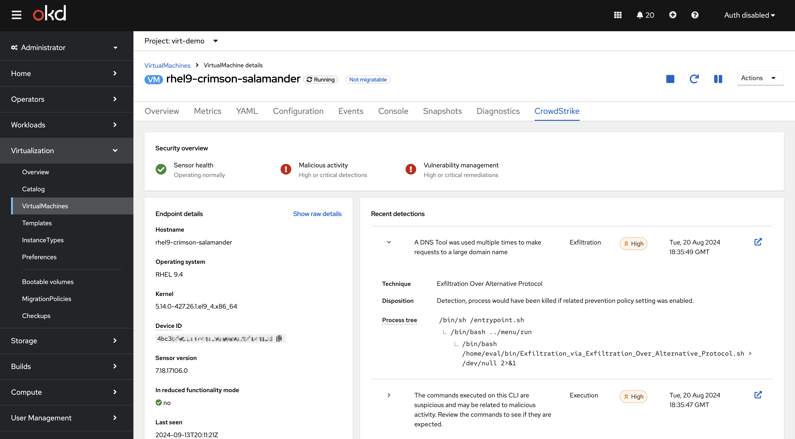
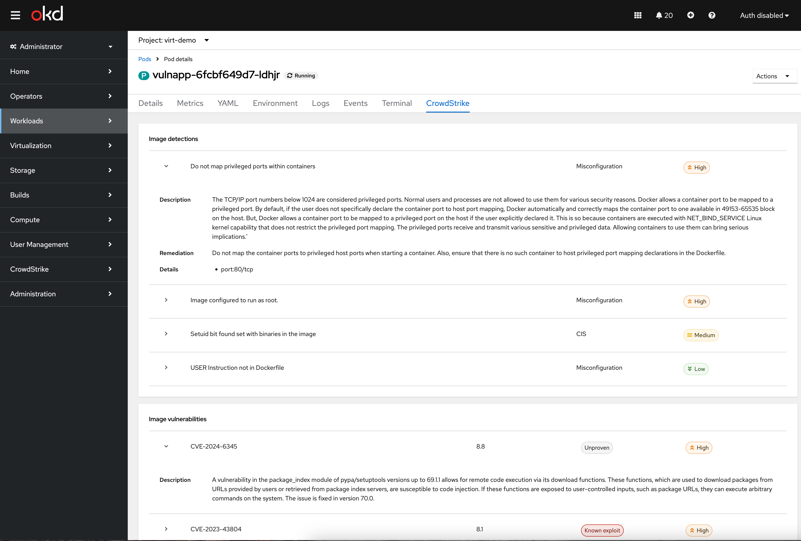

<p align="center">
   
</p>

# Falcon OpenShift Console Plugin

[](https://quay.io/repository/crowdstrike/falcon-openshift-console-plugin)

This is a dynamic plugin for the Red Hat OpenShift console. The plugin provides additional visibility
to the Falcon operator and Falcon-protected virtual machines and pods.

### Extension to the VirtualMachine page



### Extension to the Pod page



## Support

The Falcon OpenShift Console Plugin is an open source project, not a CrowdStrike product. As such, it carries no formal support, expressed or implied.

## Deployment

### Prerequisites

This plugin currently only supports CrowdStrike's US-2 cloud region.

### Deploy the Helm chart

The Falcon OpenShift Console Plugin is available at [quay.io/crowdstrike/falcon-openshift-console-plugin](https://quay.io/crowdstrike/falcon-openshift-console-plugin)

Install the chart using the name of the plugin as the Helm release name into a new namespace or an existing namespace as specified by the `plugin_console-plugin-template` parameter by using the following command:

```shell
helm upgrade -i  my-plugin charts/openshift-console-plugin -n plugin__console-plugin-template --create-namespace --set plugin.image=quay.io/crowdstrike/falcon-openshift-console-plugin:latest
```

> [!NOTE]
> When defining i18n namespace, adhere `plugin__<name-of-the-plugin>` format. The name of the plugin should be extracted from the `consolePlugin` declaration within the [package.json](package.json) file.

### Configuration

1. Create a CrowdStrike API client with the following permissions:

   - Alerts: Read
   - Hosts: Read
   - Vulnerabilities: Read

2. In the same namespace as virtual machine or pod workloads where you want security visibility, create a secret named `crowdstrike-api` with
   the following fields:

   - `client_id`
   - `client_secret`

> [!NOTE]
> This configuration assumes any user with access to read secrets in the chosen namespace should
> have access to the API client itself, as well as the related data from the Falcon platform.

If you have multiple namespaces where you want to surface CrowdStrike security data, you will need to configure a `crowdstrike-api` secret in each.

## Development

[Node.js](https://nodejs.org/en/) and [yarn](https://yarnpkg.com) are required
to build and run the example. To run OpenShift console in a container, either
[Docker](https://www.docker.com) or [podman 3.2.0+](https://podman.io) and
[oc](https://console.redhat.com/openshift/downloads) are required.

### Option 1: Local

In one terminal window, run:

1. `yarn install`
2. `yarn run start`

In another terminal window, run:

1. `oc login` (requires [oc](https://console.redhat.com/openshift/downloads) and an [OpenShift cluster](https://console.redhat.com/openshift/create))
2. `yarn run start-console` (requires [Docker](https://www.docker.com) or [podman 3.2.0+](https://podman.io))

This will run the OpenShift console in a container connected to the cluster
you've logged into. The plugin HTTP server runs on port 9001 with CORS enabled.
Navigate to <http://localhost:9000/example> to see the running plugin.

#### Running start-console with Apple silicon and podman

If you are using podman on a Mac with Apple silicon, `yarn run start-console`
might fail since it runs an amd64 image. You can workaround the problem with
[qemu-user-static](https://github.com/multiarch/qemu-user-static) by running
these commands:

```bash
podman machine ssh
sudo -i
rpm-ostree install qemu-user-static
systemctl reboot
```

### Option 2: Docker + VSCode Remote Container

Make sure the
[Remote Containers](https://marketplace.visualstudio.com/items?itemName=ms-vscode-remote.remote-containers)
extension is installed. This method uses Docker Compose where one container is
the OpenShift console and the second container is the plugin. It requires that
you have access to an existing OpenShift cluster. After the initial build, the
cached containers will help you start developing in seconds.

1. Create a `dev.env` file inside the `.devcontainer` folder with the correct values for your cluster:

```bash
OC_PLUGIN_NAME=console-plugin-template
OC_URL=https://api.example.com:6443
OC_USER=kubeadmin
OC_PASS=<password>
```

2. `(Ctrl+Shift+P) => Remote Containers: Open Folder in Container...`
3. `yarn run start`
4. Navigate to <http://localhost:9000/example>

## i18n

The plugin template demonstrates how you can translate messages in with [react-i18next](https://react.i18next.com/). The i18n namespace must match
the name of the `ConsolePlugin` resource with the `plugin__` prefix to avoid
naming conflicts. For example, the plugin template uses the
`plugin__console-plugin-template` namespace. You can use the `useTranslation` hook
with this namespace as follows:

```tsx
conster Header: React.FC = () => {
  const { t } = useTranslation('plugin__console-plugin-template');
  return <h1>{t('Hello, World!')}</h1>;
};
```

For labels in `console-extensions.json`, you can use the format
`%plugin__console-plugin-template~My Label%`. Console will replace the value with
the message for the current language from the `plugin__console-plugin-template`
namespace. For example:

```json
{
  "type": "console.navigation/section",
  "properties": {
    "id": "admin-demo-section",
    "perspective": "admin",
    "name": "%plugin__console-plugin-template~Plugin Template%"
  }
}
```

Running `yarn i18n` updates the JSON files in the `locales` folder of the
plugin template when adding or changing messages.

## Linting

This project adds prettier, eslint, and stylelint. Linting can be run with
`yarn run lint`.

The stylelint config disallows hex colors since these cause problems with dark
mode (starting in OpenShift console 4.11). You should use the
[PatternFly global CSS variables](https://patternfly-react-main.surge.sh/developer-resources/global-css-variables#global-css-variables)
for colors instead.

The stylelint config also disallows naked element selectors like `table` and
`.pf-` or `.co-` prefixed classes. This prevents plugins from accidentally
overwriting default console styles, breaking the layout of existing pages. The
best practice is to prefix your CSS classnames with your plugin name to avoid
conflicts. Please don't disable these rules without understanding how they can
break console styles!

## Reporting

Steps to generate reports

1. In command prompt, navigate to root folder and execute the command `yarn run cypress-merge`
2. Then execute command `yarn run cypress-generate`
   The cypress-report.html file is generated and should be in (/integration-tests/screenshots) directory

## References

- [Console Plugin SDK README](https://github.com/openshift/console/tree/master/frontend/packages/console-dynamic-plugin-sdk)
- [Customization Plugin Example](https://github.com/spadgett/console-customization-plugin)
- [Dynamic Plugin Enhancement Proposal](https://github.com/openshift/enhancements/blob/master/enhancements/console/dynamic-plugins.md)
